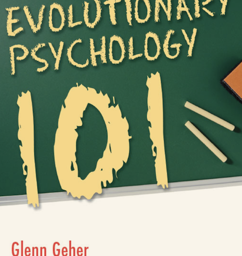
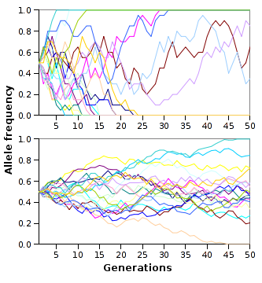

# Wprowadzenie do teorii ewolucji

## Literatura

## Ważne dzieła w historii ewolucjonizmu
- *On the Origin of Species by Means of Natural Selection, or the Preservation of Favoured Races in the Struggle for Life* (Darwin, 1859)
- *The Selfish Gene* (Dawkins, 1976)

## Zagadka - jak można połączyć te rzeczy (Geher)?
- Pingwiny cesarskie badają czy w okolicznych wodach nie ma drapieżników poprzez zepchnięcie innych pingwinów do wody
- Ziarna klonu niesione są przez wiatr na długie dystanse za pomocą "opakowania" przypominającego wirnik helikoptera
- Najczęściej dzieciobójstwa dopuszczają się macochy/ojczymi

## Zagadka - jak można połączyć te rzeczy (Geher)?
- Lwy-samce, po przejęciu haremu innego samca, zabijają wszystkie dzieci spłodzone przez innego samca
- Ekspresja uśmiechu jest interpretowana podobnie przez wszystkich ludzi na całym świecie, niezależnie od kultury

## Co to jest ewolucja?

- Ewolucja to proces zmiany *czegoś* w czasie
- Nie tylko organizmy żywe - podstawy teorii ewolucji można zastosować do wielu rzeczy

## Selekcja naturalna
- Cechy organizmu, które zwiększają jego szanse na **sukces reprodukcyjny (RS)**, są zachowane w trakcie ewolucji
- Cechy, które nie zwiększają szans na RS, nie są zachowane

## Selekcja naturalna
- Cechy zwiększające szanse na reprodukcję są najczęściej dobrze dopasowane do środowiska (*fitness*)
- Teoria ewolucji zakłada, że **środowisko** wywiera zasadniczy wpływ na kształtowanie organizmów

## Samolubne geny (Dawkins)
- To co podlega selekcji i replikacji, to tak na prawdę **geny**, a nie organizmy
- Geny, które będą się skutecznie replikować muszą:
  + replikować się wielokrotnie w ciągu życia (*fecundity*)
  + prowadzić do długiego życia, które zwiększa możliwości replikacji (*longevity*)
  + mieć wysoką jakość - replikować się dokładnie, aby geny następnych pokoleń miały niewiele błędów (*fidelity*)
- Teza o samolubnych genach jest dość kontrowersyjna - być może lepiej analizować nie pojedyncze geny a całe fenotypy - <http://pl.wikipedia.org/wiki/Samolubny_gen>

## Jak to się ma do gatunków?
- Ewolucja nie dotyczy gatunków!
- Adaptacje nie wykształciły się po to, aby umożliwić przetrwanie gatunku!
- Podział na gatunki jest **produktem** ewolucji

## Adaptacja i fitness
- Adaptacje to te cechy organizmu, które ułatwiają mu przetrwanie i reprodukcję w danym środowisku
- Adaptacje zwiększają szanse na RS
- Dopasowanie (*fitness*) dotyczy dopasowania do środowiska
- Cechy adaptacyjne zwiększają dopasowanie

## Selekcja seksualna
- Dlaczego pawie mają ogony?
- Czy pawi ogon zwiększa szanse na przetrwanie?
- Czy pawi ogon zwiększa szanse na reprodukcję?
- (dlaczego tak jest? jeśli paw może robić wszystko to co inne pawie **oraz** ma piękny ogon, pewnie ma też inne silne geny)

## Dwa warianty selekcji seksualnej
- Selekcja **interseksualna** - cechy są atrakcyjne dla płci przeciwnej (pawi ogon, szerokie ramiona, kobiece kształty)
- Selekcja **intraseksualna** - cechy zwiększające przewagę w walce o płeć przeciwną (rogi u jeleni i łosi, wojny u ludzi)

## Mechanizmy ewolucji
- Selekcja naturalna
- Selekcja seksualna
- **Dryf genetyczny** - wydarzenia "losowe" w historii genotypów
- **Spandrels** - efekty uboczne, pojawiające się w trakcie ewolucji, które nie mają roli adaptacyjnej
- Np. umiejętność czytania nie jest adaptacją ewolucyjną, została wykształcona jako skutek uboczny wykształcenia się języka, muzyka jako "słuchowy sernik" (*auditory cheesecake*) (Pinker, 1999)

## Symulacja dryfu genetycznego

## Selekcja wielopoziomowa (Wilson, 2007)
- Mechanizmy ewolucyjne działają na wielu poziomach jednocześnie: na poziomie genu, genotypu, jednostki, grupy społecznej
- Jakaś cecha może być adaptacyjna na jednym poziomie, a nieadaptacyjna na innych!
- Np. prospołeczność jest nieadaptacyjna na poziomie jednostki, ale na poziomie grupy społecznej już tak

## Ewolucja kultury, memy (Dawkins, 1989)
- Tak jak geny kodują cechy fizyczne organizmu, **memy** kodują cechy kulturowe
- Nauka o memach - memetyka
- Memetyka to zastosowanie teorii ewolucji do rozwoju kultury ludzkiej

## Środowisko adaptacji ewolucyjnej (Bowlby, 1969)
- Ang. *environment of evolutionary adaptedness (EEA)*
- Takie środowisko, dla którego wykształciły się adaptacje na drodze ewolucji
- Jeżeli środowisko szybko się zmienia, ewolucja nie nadąża

## Jakie jest EEA ludzi?
- Zbieracko-łowieckie bandy, złożone z ok. 150 osobników (pamiętacie liczbę Dunbara?), w których ludzie byli dość mocno spokrewnieni ze sobą
- *"Our modern skulls house a Stone Age mind"* - Cosmides & Tooby, 1997

## Tylko kilka przykładów rozdźwięku pomiędzy EEA a współczesnym środowiskiem
- Preferowanie jedzenia tłustego i słodkiego (głód był normą na sawannie afrykańskiej)
- Kultury kolektywistyczne
- Słaba odporność na przewlekły stres

## Założenia psychologii ewolucyjnej

1. Organizmy są produktami selekcji naturalnej i innych procesów ewolucyjnych
2. Specyficzne cechy organizmów są więc również produktami ewolucji
3. Ludzki układ nerwowy jest ważną fizyczną cechą naszego gatunku (mózg jest najbardziej skomplikowanym ludzkim organem)
4. Całość zachowania jest wynikiem pracy układu nerwowego
5. Ludzkie zachowanie jest więc rezultatem ewolucji

## Zachowanie z perspektywy ewolucji
- Zachowanie jest adaptacją, która u organizmów z układem nerwowym pozwala reagować na bodźce ze środowiska
- Np. trawa nie ma układu nerwowego, więc nie może uciec przed krową...
- *"Evolutionary psychology is the radical notion that human behavior is part of the natural world"*

## Ewolucja jest kiepskim projektantem

## Ewolucja jest kiepskim projektantem

## Ewolucja jest kiepskim projektantem
- *"Ostatnim idealnie zaprojektowanym organizmem był rekin..."* - Noam Chomsky
- Mechanizmy ewolucyjne nie dążą do tego, by organizmy były idealnie zaprojektowane!
- Większość adaptacji wiąże się też z "negatywnymi" skutkami ubocznymi (np. choroby psychiczne)

## Pojęcia
- Selekcja naturalna (*natural selection*)
- Selekcja seksualna (*sexual selection*)
- Sukces reprodukcyjny (**RS** - *reproductive success*)
- Dziedziczność (*heritability*)
- Mutacja (*mutation*)
- Adaptacja (*adaptation*)
- Fitness
